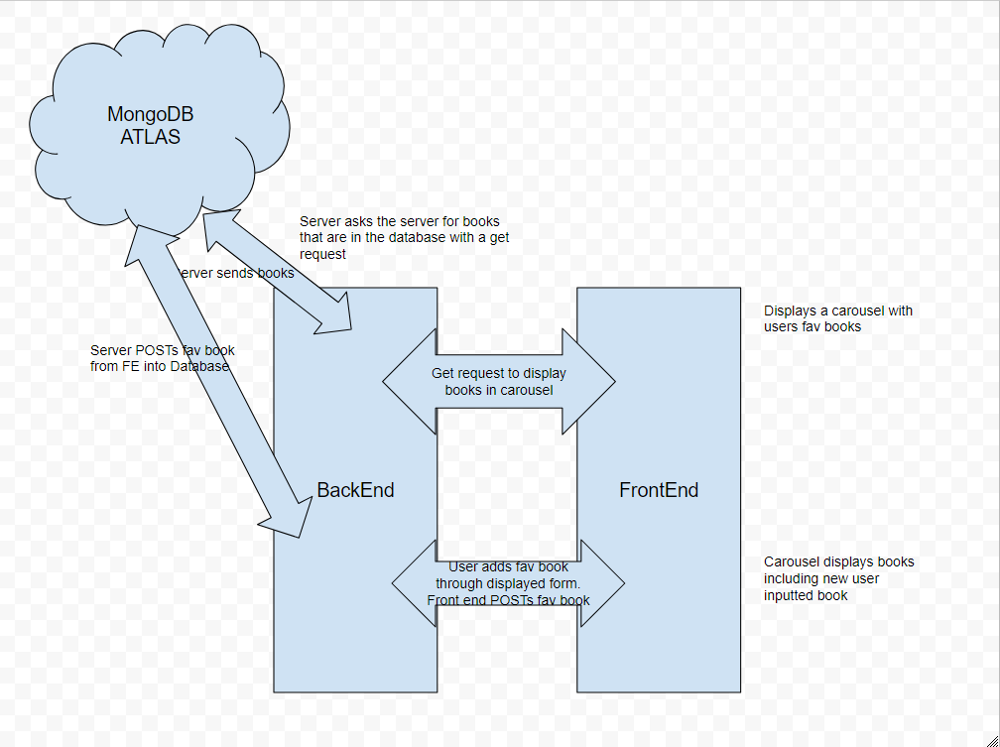

# Can of Books

**Author**: Brendan Huddleston, Zach Moore
**Version**: 1.0.0 (increment the patch/fix version number if you make more commits past your first submission)

## Overview
<!-- Provide a high level overview of what this application is and why you are building it, beyond the fact that it's an assignment for this class. (i.e. What's your problem domain?) -->

This application allows users to insert/remove their favorite books to be displayed on a carousel with the title, author and description.

## Getting Started
<!-- What are the steps that a user must take in order to build this app on their own machine and get it running? -->

Clone repositories down.

## Architecture
<!-- Provide a detailed description of the application design. What technologies (languages, libraries, etc) you're using, and any other relevant design information. -->

## Change Log
<!-- Use this area to document the iterative changes made to your application as each feature is successfully implemented. Use time stamps. Here's an example:

01-01-2001 4:59pm - Application now has a fully-functional express server, with a GET route for the location resource. -->

- 11 DEC 2023 Created full stack app that renders seeded books onto page.

- 12 DEC 2023 implemented creating/deletion into app. via form that allows users to add their own books(as well as delete them) with books being stored in the DB

## Estimates
<!-- See below -->

Name of feature: Lab 11 Implementing Mongo and CRUD

Estimate of time needed to complete: 5hrs

Start time: 5pm CST

Finish time: 11pm CST

Actual time needed to complete: 6hrs

Name of feature: Lab 12 Create and Delete

Estimate of time needed to complete: 5hrs

Start time: 4pm CST

Finish time: 8pm CST

Actual time needed to complete: 4hrs

## Credit and Collaborations
<!-- Give credit (and a link) to other people or resources that helped you build this application. -->

- Zach Moore, Front End Development